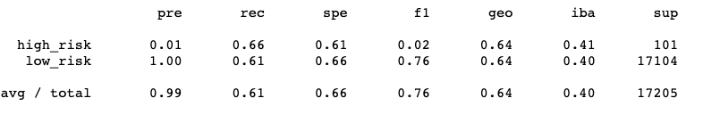
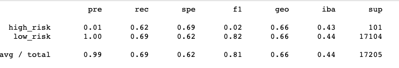
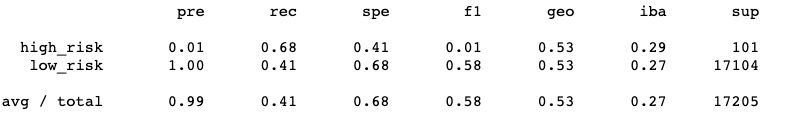
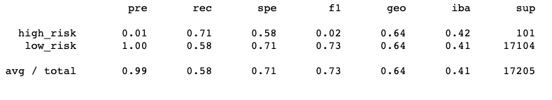
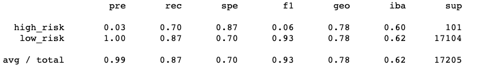
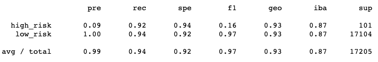

# Credit_Risk_Analysis

# Overview
The goal of this project was to provide the most accurate analysis on credit risk. To do this I compared different techniques that handle unbalanced classes. 

# Results
Random Oversampling | SMOTE
:-------------------------:|:-------------------------:
| 
Balanced Accuracy Score - .64 |Balanced Accuracy Score - .66

Undersampling | SMOTEENN
:-------------------------:|:-------------------------:
| 
Balanced Accuracy Score - .56 |Balanced Accuracy Score - .65

Balanced Random Forest | Easy Ensemble AdaBoost
:-------------------------:|:-------------------------:
| 
Balanced Accuracy Score - .79 |Balanced Accuracy Score - .93

## Summary 
All of these techniques for detecting high risk applicants tend to fall extremly low in recall. This means alot of false positives. If turning down alot of potential customers is not of importance then the Easy Ensemble AdaBoost is perfect because its very good at predicting the low risks. Otherwise its best to try to improve the model.
